# Darwinian Workspace

## Baseline A
- 对应纯 `zero-shot VLM` 基线，不引入任何跨任务记忆机制
- 每个任务只基于当前界面观测、任务目标和任务内历史轨迹决策。
- Chain: `run_baseline_a_zero_shot.sh` -> `dms_repro.runner` -> `PALiteAgent` -> `QwenVLClient` -> `AndroidWorld`

## Baseline B
- 对应 `static memory` 基线，在Baseline A中额外引入按时间顺序追加的静态跨任务记忆。
- 每个任务不仅基于当前界面观测、任务目标和任务内历史轨迹决策外，还将过往任务轨迹作为prompt 上下文直接拼接给planner；但不做分层检索、动态淘汰或进化更新。
- Chain: `run_baseline_b_static_memory.sh` -> `dms_repro.runner` -> `StaticMemory` -> `PALiteAgent` -> `QwenVLClient` -> `AndroidWorld`

## DMS
- 对应paper中的 `Darwinian Memory System`，在 `PA-Lite + VLM` 骨架上引入分层记忆、utility/survival 驱动检索、risk suppression、mutation 和 dynamic pruning。
- 先构造成 memory unit，再按当前 subtask 做 retrieval / replay / mutate。
- Chain: `run_dms_hierarchical_memory.sh` -> `dms_repro.runner` -> `build_darwinian_memory_backend` -> `DarwinianMemorySystem` -> `DMSAgent` / `DMSMemoryAdapter` -> `QwenVLClient` -> `AndroidWorld`
- 分层记忆架构：把 subtask 的意图信息和动作轨迹分开存储。
- 双因子检索：对当前 subtask 的 precondition 和 goal 分别做相似度匹配。
- 轨迹回放（replay）：当检索命中安全且高价值的 memory 时，直接复用对应动作轨迹。
- Survival Value 评分：为每条 memory 结合复用次数、时间衰减、成功失败反馈、无效动作率和执行错误率计算“生存价值”。
- 风险抑制（risk suppression）：根据 memory 的历史成功/失败统计估计风险分数，对高风险经验进行抑制。
- Epsilon Mutation：即使命中了可复用 memory，系统仍保留小概率做变异探索，用来寻找比旧经验更优的新轨迹。
- 变异替换（replacement）：当 mutation 产生更有效的成功轨迹时，替换旧 memory，实现经验进化。
- 动态剪枝（dynamic pruning）：当 memory bank 接近容量上限时，按 survival value 删除低价值经验。

Survival Value：
- 对每条 memory，根据 `reuse_count`、`time decay`、`success / failure`、`invalid action rate` 和 `execution error rate` 计算其生存价值。
- 相关代码实现见 [darwinian_memory.py](working_space/src/dms_repro/darwinian_memory.py) 的 `_survival_value(...)`。
- 公式可以概括为：`survival_value = utility * adaptive_decay * reliability`。
- survival 值的刷新入口见 [darwinian_memory.py](working_space/src/dms_repro/darwinian_memory.py) 的 `_refresh_entry(...)`，每次 memory 被创建、复用、失败回写或任务结束后都会更新。

Dynamic Pruning：
- 当 memory bank 接近当前容量上限时，系统会按 memory 的 `survival_value` 排序，根据 score 曲线的 elbow 位置决定保留数量。
- 如果 elbow 位置说明高价值 memory 仍然较多，则扩容；否则将 elbow 后的低价值 memory 标记为 `dynamic_pruning`。
- 相关代码实现见 [darwinian_memory.py](working_space/src/dms_repro/darwinian_memory.py) 的 `_prune_if_needed(...)`。

## Settings Details
- 本复现工程基于 `AndroidWorld` 动态 GUI 环境，在本地 Android emulator 上完成三种方法的统一评测。
- emulator 配置见 [runtime.yaml](working_space/configs/runtime.yaml)，当前使用的 AVD 为 `AndroidWorldAvd`，对应本地 Android SDK、ADB、emulator 和 accessibility forwarder 运行链路。
- Model Backbone 均使用 `Qwen/Qwen2.5-VL-7B-Instruct` 作为底层决策模型，配置见 [model_qwen25vl_7b.yaml](working_space/configs/model_qwen25vl_7b.yaml)。
- DMS 额外使用 `all-MiniLM-L6-v2` 作为文本 embedding 模型，用于 memory 检索中的相似度计算；对应配置见 [eval_baselines.yaml](working_space/configs/eval_baselines.yaml)。

## Running

### Preparation
```bash
# 创建虚拟环境并安装requirements.txt
conda create -y -p ./working_space/conda_envs/dms_py310 python=3.10
conda activate ./working_space/conda_envs/dms_py310
pip install -r working_space/requirements.txt

# or run 此一键创建环境脚本
bash working_space/scripts/setup_python_env.sh
```

```bash
# 在 Python 环境准备完成后，再运行一键装载其余运行资产：
bash working_space/scripts/setup_runtime_assets.sh
```

- 该脚本会自动完成以下准备工作：
  - 下载 `Qwen/Qwen2.5-VL-7B-Instruct` 到 `working_space/model_cache/huggingface`
  - 下载 `all-MiniLM-L6-v2` 到 `working_space/model_cache/modelscope/AI-ModelScope/all-MiniLM-L6-v2`
  - 下载并安装 Android SDK / emulator / `AndroidWorldAvd` 到 `working_space/android_sdk` 与 `working_space/android_avd`
  - 下载 `accessibility_forwarder.apk` 到 `working_space/downloads/accessibility_forwarder.apk`
  - 下载并展开 JDK 17 到 `working_space/jdks/jdk17`
  - 以后台 `tmux` 会话 `dms_androidworld` 启动 emulator，并写日志到 `working_space/logs/androidworld_emulator.log`
  - 运行 AndroidWorld 一次性 app setup，并生成 `working_space/logs/androidworld_setup.json`
  - 运行环境连通性检查，并生成 `working_space/logs/androidworld_env_check.json`

如果希望直接全量一键执行，也可以run following code：
```bash
bash working_space/scripts/bootstrap_clone_setup.sh
```

### Running the Code
```bash
# Baseline A
bash working_space/scripts/run_baseline_a_zero_shot.sh \
  working_space/datasets/mini_benchmark_20apps.yaml 5 0
```

```bash
# Baseline B
bash working_space/scripts/run_baseline_b_static_memory.sh \
  working_space/datasets/mini_benchmark_20apps.yaml 5 0
```

```bash
# DMS
bash working_space/scripts/run_dms_hierarchical_memory.sh \
  working_space/datasets/mini_benchmark_20apps.yaml 5 0
```

- 三个脚本的参数顺序统一为 `dataset_path rounds gpu_id`；上面的最后一个 `0` 就是要使用的 GPU 编号。
- 如果不显式传第三个参数，工程默认使用 `gpu_id=0`。
- 终端会打印最终的 run summary JSON，更细粒度的 step-level 执行日志默认落在 `working_space/runs/<method>/<timestamp>/` 目录下，而不是持续刷在终端。
- 通用运行产物包括 `run_config.json`、`steps.jsonl`、`task_results.jsonl`、`latest_result.json` 和 `metrics.json`。
- DMS 还会额外输出 `dms_retrievals.jsonl`、`dms_pruning.jsonl`、`dms_mutations.jsonl`、`dms_events.jsonl` 和 `dms_summary.json`。


## Visualizations
Baseline A vs. DMS:
<table>
  <tr>
    <td>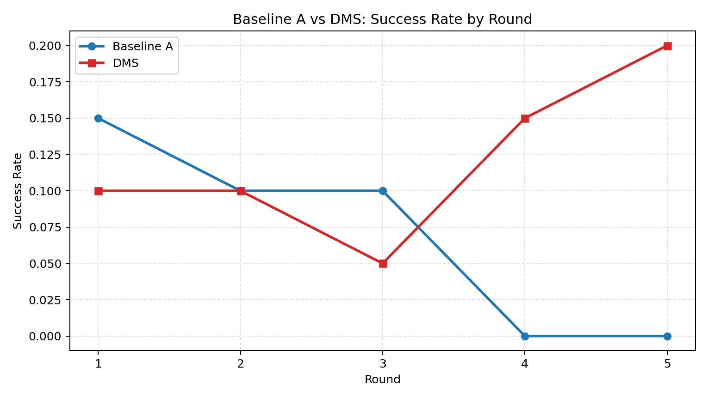</td>
    <td>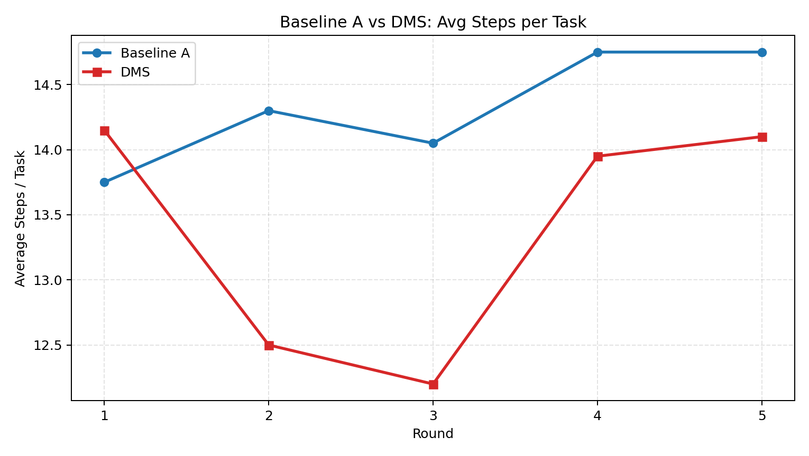</td>
  </tr>
  <tr>
    <td>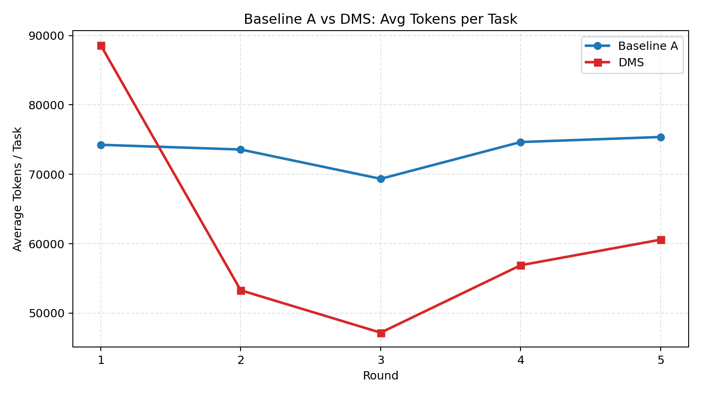</td>
    <td>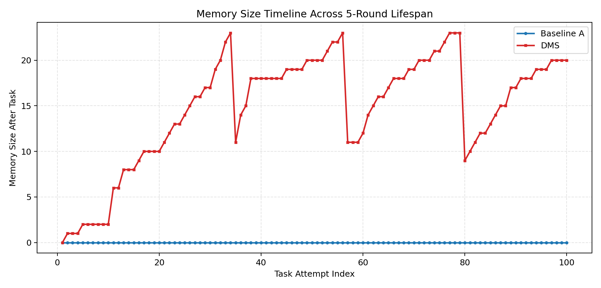</td>
  </tr>
</table>

- DMS 相比 `Baseline A` 在同一 `mini-benchmark` 上把成功率从 7% 提升到 12%，同时平均 token 和平均 step 都更低。


Baseline B vs. DMS:
<table>
  <tr>
    <td>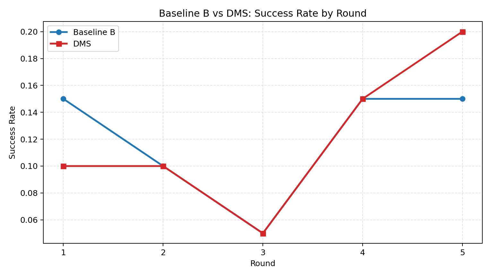</td>
    <td>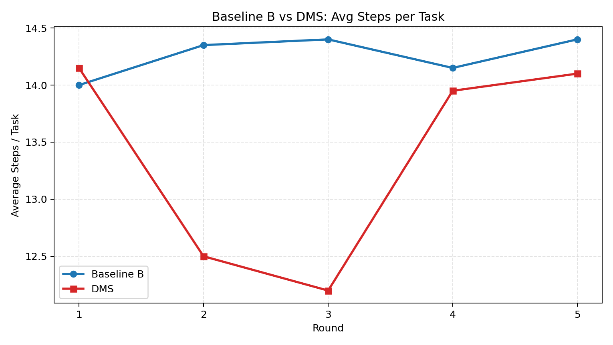</td>
  </tr>
  <tr>
    <td>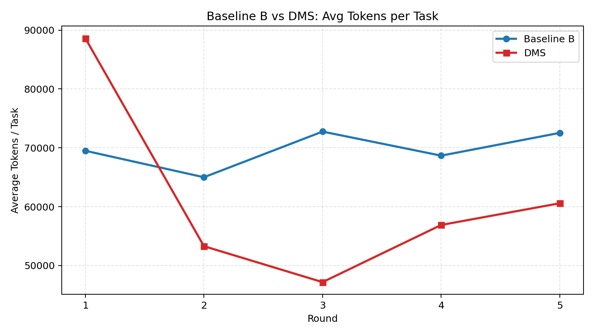</td>
    <td>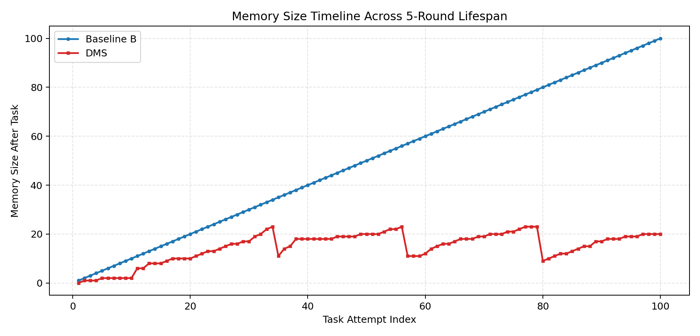</td>
  </tr>
</table>

- DMS 与 `Baseline B` 的总体成功率同为 12%，但 DMS 用更少的 token、更少的 step，并把最终 memory size 从 100 压到 20。


Results of DMS:

<table>
  <tr>
    <td>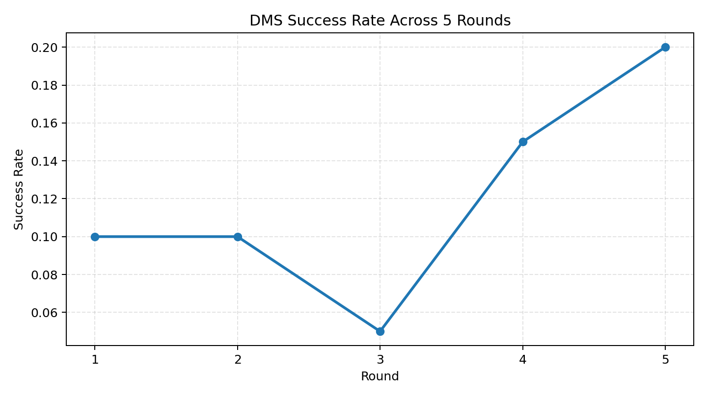</td>
    <td>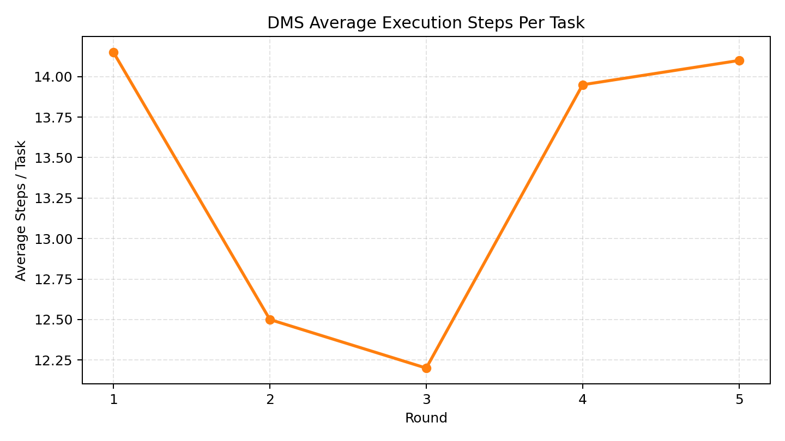</td>
  </tr>
  <tr>
    <td>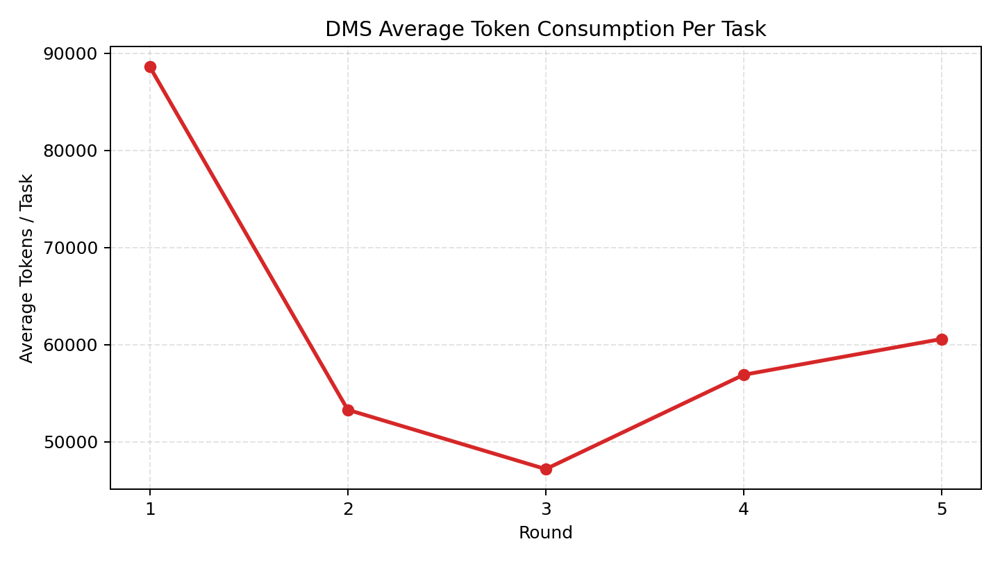</td>
    <td>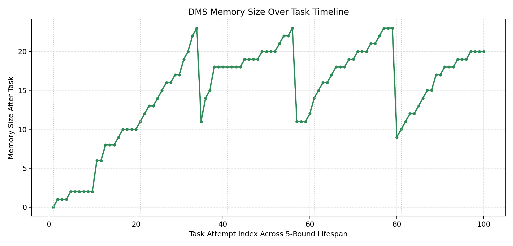</td>
  </tr>
</table>

- DMS 在前两轮建立经验后，后续轮次成功率逐步回升，到第 5 轮达到 20%，说明记忆检索与剪枝开始产生稳定收益。


## Gap Analysis And Thinking...
### Observed Gap to the Paper
- 论文中 `DMS-PA-Lite + Qwen2.5-VL-72B` 在 `AndroidWorld` 上可达到 66.4% success rate；而我们当前 5 轮 `mini-benchmark` 上，DMS 的总体成功率为仅 12%。
- 从五轮曲线看，DMS 的 success rate 呈现先下降再上升的趋势，记忆累计有效，但收益出现得更慢。

### To Mitigate the Model Gap
- 初步实现时，7B model输出的token和遵循约束能力十分差，使得Planner和Actor极易出现明显异常，甚至无法正常地迈出第一步，循环崩溃。
- 为尽量隔离 `memory mechanism` 与 `backbone capacity` 两个因素，我们保留了论文 Appendix H 中 `Planner-Actor` 的主骨架和核心 prompt 结构，使 `Baseline A / Baseline B / DMS` 的差异仍主要来自记忆机制本身，而不是额外 prompt engineering。
- 在 planner 侧，我们保持论文中的 `1-5` 步短规划形式，避免 7B 模型一次性生成过长计划时发生明显漂移。
- 在 actor 侧，我们进一步强化了执行约束，如：单步只允许一个 tool call、禁止隐式追加动作、禁止重复已失败动作、优先使用当前 UI index、索引不可信时回退到坐标点击，以降低 7B Model常见的 overreach 和 hallucinated action。
- 在 DMS 注入方式上，我们没有简单扩大上下文，而是尽量按论文思路做结构化补偿：planner 侧注入 retrieval / pruning / risk diagnostics，actor 侧注入 replay / mutation fallback / remember guidance，让 7B 优先复用已验证轨迹。
- 在 memory 参数上，我们采用了较保守的上下文和阈值控制，如： `planner_max_subtasks = 5`、`max_context_entries = 12`、DMS `top_k = 3`、`min_retrieval_score = 0.25`、 `min_capacity = 24`、`max_capacity = 96`，以避免小模型被过长历史轨迹或低质量记忆淹没，尽量释放出小模型可用的决策能力。
